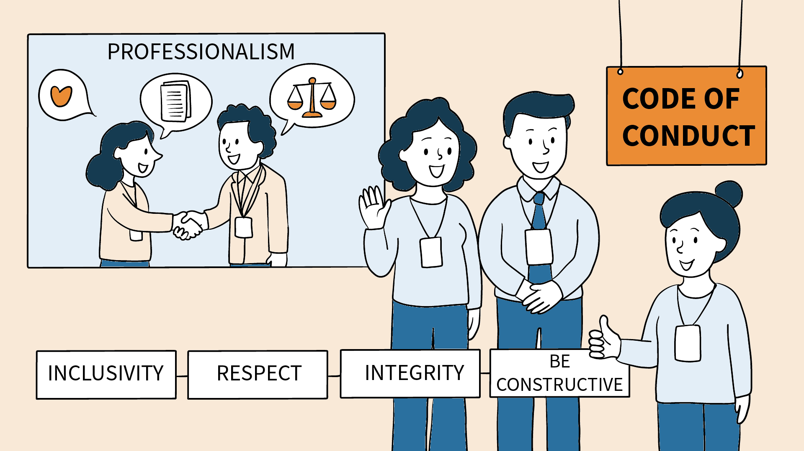

# Code of Conduct

  

## Overview

The **SEMANTiCS Conference** is committed to providing a **professional, respectful, and inclusive environment** for sharing academic research and fostering scholarly collaboration. This Code of Conduct applies to all participants, including attendees, speakers, organizers, sponsors, reviewers, and volunteers, across **all conference-related activities**, whether in person or virtual.
We expect all participants to engage in **scientific exchange with integrity and respect**, and to contribute to a **safe and constructive academic environment**.

## Expected Professional Conduct

All participants must:

- Treat others with respect and collegiality, regardless of academic status, gender, race, ethnicity, age, religion, sexual orientation, gender identity, national origin, disability, or personal beliefs.
- Engage in discussions and critiques in a constructive, scholarly, and evidence-based manner.
- Provide and accept feedback professionally and courteously.
- Respect the intellectual property of others and adhere to standards of academic integrity and attribution.
  Follow the rules and guidelines of the conference, including session formats and timekeeping.

This Code of Conduct applies to **all aspects of SEMANTiCS 2026**.

## Reporting Misconduct

If you experience or witness conduct that violates this policy:
Contact the organizers at the conference, specially the general chair directly, or the Conduct Committee: [semantics@infai.org](mailto:semantics@infai.org)

**All reports will be handled discreetly and professionally. No retaliation will be tolerated.**

## Response to Misconduct

If a participant engages in behavior that violates this Code of Conduct, the conference organizers reserve the right to take appropriate measures in response. These measures may include, but are not limited to:

- Issuing a verbal or written warning
- Revoking access to the event, either temporarily or permanently, without refund
- Restricting future participation in conferences or related activities organized by the community
- Notifying the individual’s home institution, employer, or relevant funding agencies
- Contacting appropriate legal or regulatory authorities when necessary

Dismissive explanations such as “it was a joke” will not be considered a valid defense.
An appeals process will be made available to those subject to disciplinary action. Complaints or concerns raised in good faith will be taken seriously and handled confidentially, without fear of retaliation. Reports made to designated conduct officers during the event will be reviewed and addressed promptly in accordance with the conference’s Code of Conduct procedures.

## Commitment to an Inclusive Research Community

SEMANTiCS actively promotes equality, diversity, and inclusion in the academic community. This Code of Conduct complements our [Equity, Diversity and Inclusion policy](https://2026-eu.semantics.cc/page/edi) and reflects our collective responsibility to uphold the highest standards of professionalism and respect.
