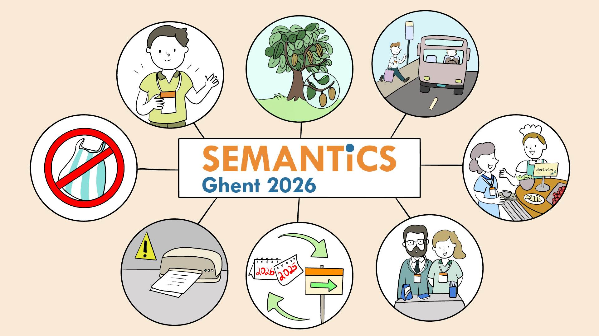

# Our Commitment to Responsible Events

  

Over the past years, while advancing the sharing of cutting-edge research in Artificial Intelligence, Machine Learning, Knowledge Graphs, Semantics, Ontologies, and Representation Learning, the SEMANTiCS Conference has also taken deliberate steps to raise awareness of sustainability in event organisation - for example, by encouraging low-waste practices, responsible travel choices, and mindful use of resources.  
In each edition, the General Chairs, together with that year’s local organising team, have placed a strong emphasis on planet care, not only discussing how AI can help address environmental challenges, but also ensuring our conference organisation itself reflects these values.

## Carbon Offsetting

The centrepiece of SEMANTiCS’ environmental commitment has been our tree planting initiative. Together with our partners, we have planted 43 trees over the years as a possible tangible action to start addressing our carbon footprint.  
Crucially, this initiative is far more than just a symbolic gesture; it ensures that the positive impact endures long after the conference concludes, as the trees grow and thrive. They represent a lasting and visible contribution to environmental care, guaranteeing that SEMANTiCS leaves behind a truly living legacy for a greener future.

## Additional Sustainable Measures

Beyond planting trees, we also took steps to make the conference more sustainable in many practical ways, including:

### Sustainable Materials and Waste Reduction

- **No plastic in name badges**. We made a conscious decision to eliminate single-use plastics from essential conference materials, starting with the name badges.
- **Avoiding unnecessary conference bags and giveaways**. We actively reduced resource consumption by limiting the distribution of traditional conference bags and promotional giveaways, items that often go unused or end up as waste.
- **Printed materials kept to a minimum**. To save paper and resources, all essential documents, including programs, abstracts, and announcements, are provided digitally, reducing our reliance on printing. We also promote and recommend that presenting authors print their scientific posters using recycled paper or fabric.
- **Re-usable decoration and equipment**. We are dedicated to the circular economy by designing stands, signage, and various pieces of equipment specifically for reuse across multiple conference editions.
- **Sponsorship and advertising material**. While refining our sponsorship packages, we reduced non-recyclable materials and encouraged sponsors to be mindful of their environmental impact—not only at SEMANTiCS but at all events they participate in.

### Greener Mobility and Travel

- **Optimised travel plans**. We actively encourage both participants and speakers to plan their trips responsibly, considering the environmental impact of their transportation choices.
- **Encouraging public transport and shared mobility**. Within the host cities, we provide guidance and resources to steer attendees toward the use of public transportation and shared mobility options, further reducing local emissions.

### Catering

- **Mostly vegetarian food**. Our catering is intentionally designed to be climate-friendly by featuring predominantly vegetarian menus, which have a lower carbon footprint than meat-based options.
- **Local and seasonal food sourcing**. We prioritise sustainability and freshness by choosing regional and seasonal products for our catering, which minimises the transportation emissions and supports local producers.
- **Elimination of single-use plastic dishware**. We made a firm commitment to sustainability by using non-plastic cutlery, cups, and bottles. This decision significantly reduces disposable waste and eliminates harmful single-use plastics from our food service.
- **Surplus food donation**. To minimise food waste, we commit to coordinating with local charities and food banks to donate all safe, surplus catered food on a daily basis throughout the conference.

## AI for Good

Throughout all conference tracks, we encourage the community to consider how changes in their respective AI workflows or use cases interact with actual or potential changes in societal impact and resource use as well as with the sustainability of the respective societal or resource contexts. Here are some example questions worth pondering in this context: Which communities are affected by your AI activities, and do they and you have a shared vision on whether and how this could or should develop further? What resources do your AI-related activities use (e.g. human labour, data, software, machine labour, energy, water, money), and how do you contribute to enough of these resources still being available in the future for activities similar to yours? Ideally, every submission to and every presentation at the conference would make a serious attempt at addressing these questions, and the conference organisers will attempt to put some structure to that and distill the insights gained this way into the planning of this event and future ones.

## Our Pledge

We are conscious that any decision we make when organising SEMANTiCS events carries consequences. Our non-negotiable pledge is to make such decisions with mindfulness and an unwavering commitment to the planet as a shared resource of all humans.

## Collaborate with Us

We invite other conferences, organisations, research institutes and companies active in environmental awareness to collaborate with SEMANTiCS in promoting mindful, sustainability-oriented event organisation and in sharing best practices with our community.
