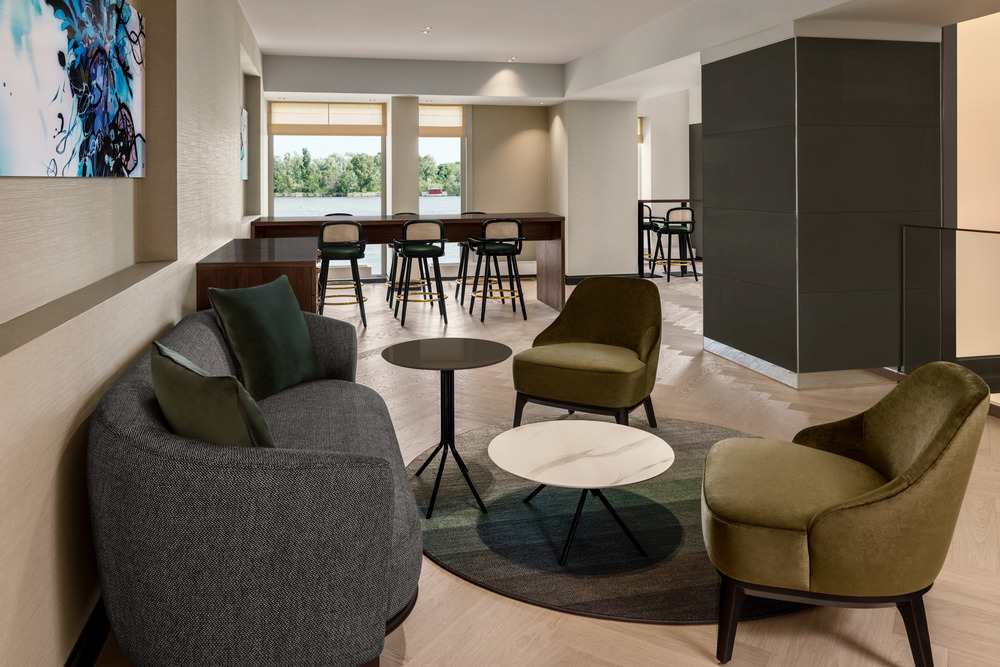
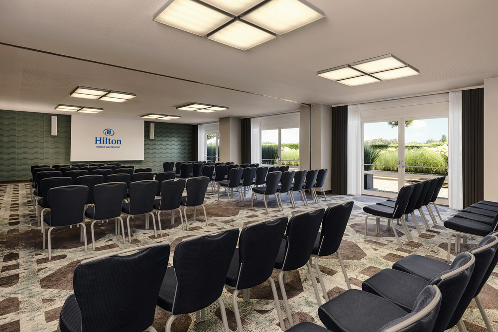

# Venue

 
   
   

 

**_SEMANTiCS 2026 will take place from September 3–5, with the Vienna University of Business and Economics serving as the local organizer, supported by the Semantic Web Company. This year's conference will be hosted at the Hilton Hotel Waterfront in Vienna, providing an exceptional venue for industry and academic experts to connect and collaborate._**

Handelskai 269, 1020 Wien, Austria

## Accommodation

Vienna offers a diverse selection of accommodations to suit different budgets and preferences. To book a room at the conference hotel, please buy a SEMANTiCS conference ticket and we will share the booking link. Event participants can enjoy a 15% discount on the Best Available Rate.

<!-- [Reservation at the Hilton Hotel Waterfront](https://www.hilton.com/en/attend-my-event/viehahi-asema-a8c0c685-9f6e-4d60-83c0-ad8e7d866430/) -->
<!-- [Reservation at the Hilton Hotel Waterfront](https://www.hilton.com/en/hotels/viehahi-hilton-vienna-waterfront/) -->

As all our event venues are conveniently located along the U2 subway line, you may also consider nearby hotels or other accommodations within walking distance.

Here are a few suggestions for accommodation close to the conference venue:

| Name                                                | Address                                        | Link                                                                                |
| --------------------------------------------------- | ---------------------------------------------- | ----------------------------------------------------------------------------------- |
| Hotel Courtyard Vienna Prater/Messe                 | Trabrennstrasse 4, 1020 Vienna                 | https://www.booking.com/hotel/at/courtyard-by-marriott-wien-messe.html              |
| Vienna Residence, Stuwerviertel - Exhibition Center | Stuwerstraße 60, 02. Leopoldstadt, 1020 Vienna | https://www.booking.com/hotel/at/vienna-residence-theme-park-exhibition-center.html |
| Spark by Hilton Vienna Messe Prater                 | Messestraße 2, 1020 Vienna                     | https://www.hilton.com/de/hotels/viemepe-spark-vienna-messe-prater/                 |
| Motel One Wien-Prater                               | Ausstellungsstraße 40, 1020 Vienna             | https://www.motel-one.com/de/hotels/wien/hotel-wien-prater/                         |

## Getting there by plane

<!-- 
 Fly in by plane
 -->

Vienna International Airport is about 20 km from the city centre of Vienna, which can easily be reached by Airport Bus Shuttle, CAT (City Airport Train), train (S-Bahn), airport bus shuttle or taxi.

### City Airport Train (CAT)

The CAT takes you to the City Air Terminal (Wien-Mitte/Landstrasse, undergrounds U3 and U4) in 16 minutes. From Wien-Mitte/Landstrasse, take the underground U4 direction Heiligenstadt and take a stop at Schottenring. At Schottenring, change to underground U2, direction Seestadt or Aspernstrasse. Get off at Stop Stadion, 5 stops from Praterstern. From there, it's just an 8-minute walk to the conference venue.

CATs leave the airport every half hour from 6:07 am to 11:37 pm. Several airlines offer check-in services at the City Air Terminal.

[Ticket Pricing](https://www.cityairporttrain.com/en/prices) (Tickets are only valid for the CAT, not for public transport in Vienna!)

[CAT schedule](https://www.cityairporttrain.com/en/info-service/timetable)

### Train

To get to the airport train, follow the sign “S-Bahn” in the airport arrival hall. Take line S7, travel time: around 25 minutes. At stop Praterstern, change to underground U2, direction Seestadt or Aspernstrasse. Get off at Stop Stadion, 5 stops from Praterstern. You can buy the ticket at the ticket machine in the train station or online (single ticket: 2,40 Euro). Careful: Viennese public transport is segmented in different zones. While most of the city lies in Zone 1, you'll cross an additional zone when travelling to and from the airport, which means that you'll need 2 tickets instead of just one.

[Train schedule](https://www.schnellbahn-wien.at/web/flughafen_wien-schwechat.html) (German)

If you plan to use public transport extensively, you may want to install the [Wiener Linien-App](https://www.wienerlinien.at/wienmobil-app) for tickets and navigation.

### Airport Bus Shuttle

The bus station is directly in front of the airport arrival hall. The bus VAL3 line stopping near the conference venue (Stop Stadion) leaves every 60 minutes, but not at night times, although buses to the city center will operate 24 hours. The bus trip is around 20 minutes and from Stop Stadin, it's just an 8-minute walk to the conference venue. Tickets (8 Euro) can be bought on the bus, from the ticket machine or online. Tickets are only valid for the shuttle bus, not for public transport in Vienna!

[Bus schedule](https://www.viennaairport.com/jart/prj3/va/uploads/data-uploads/Passagier/Parken/VIE_VAL3_de_en.pdf) (German)

### Taxi

The taxi stand at the airport is in front of the arrival hall. It takes about half an hour to get to the city centre (approx. 30 Euro). To go from the city to the airport, either ask your hotel to book an airport taxi or call one of the following taxi companies (all of them offer special fares to the airport): 31300, 40100, 60160, 81400 or 1716. You can also book online, e.g. [Airport Driver](https://airportdriver.at/en/).

## Getting to there by Railway

If you arrive in Vienna by railway, you will be landing in one of the stations listed below and then you need to use Vienna public transport to get to the conference venue. If you plan to use public transport extensively, you may want to install the [Wiener Linien-App](https://www.wienerlinien.at/wienmobil-app). for tickets and navigation. You can buy the ticket for the Vienna public transport at the ticket machine in the train station or online (single ticket: 2,40 Euro).

### Wien Hauptbahnhof (Vienna Central Train Station)

Take underground U1, direction Leopoldau. At stop Praterstern change to underground U2, direction Seestadt or Aspernstrasse. Get off at Stop Stadion. From there, it's just an 8-minute walk to the conference venue.

### Wien Westbahnhof (Vienna West Train Station)

Take underground U3, direction Simmering. At stop Volkstheater change to underground U2, direction Seestadt or Aspernstrasse. Get off at Stop Stadion. From there, it's just an 8-minute walk to the conference venue.

### Wien Bahnhof Meidling (Vienna Station Meidling)

Take underground U6, direction Floridsdorf. At stop Längenfeldgasse change to underground U4, direction Heiligenstadt. At stop Schottenring change to underground U2, direction Seestadt or Aspernstrasse. Get off at Stop Stadion. From there, it's just an 8-minute walk to the conference venue.
