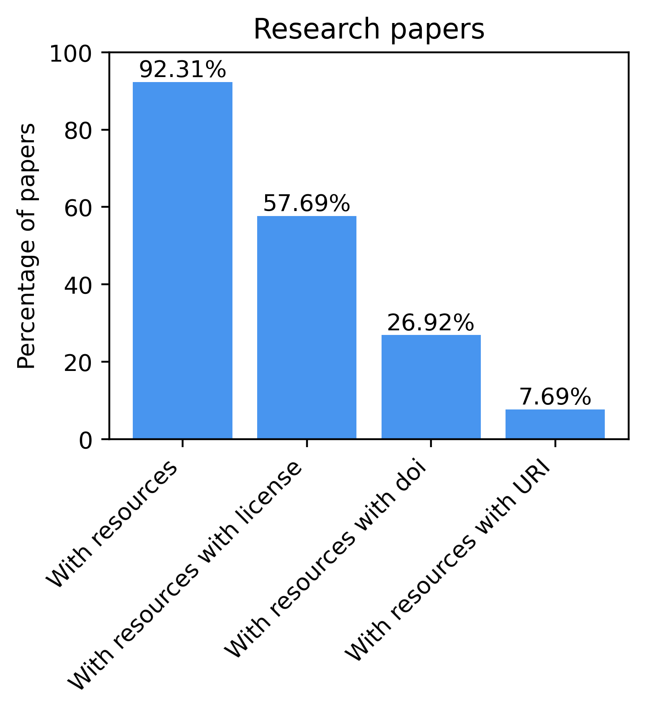
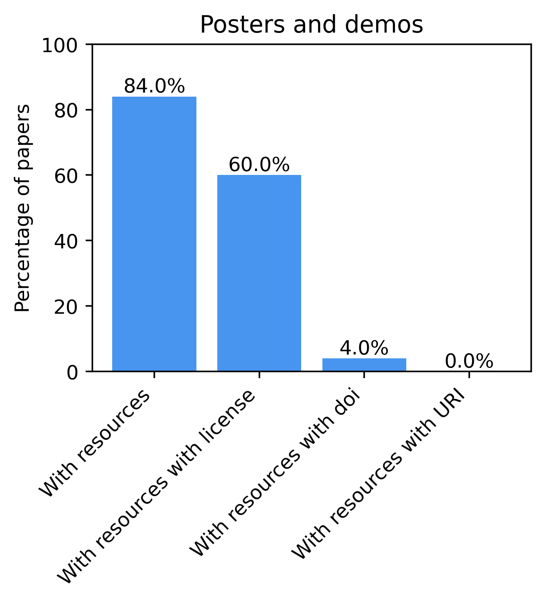

# Statistics about the Semantics 2024 KG

The script `generate_stats.py` generates statistics on the Semantics 2024 KG. It will also serialize the KG in TTL.

## Requirements
* rdflib
* matplotlib

## Running scripe
From the current folder: `python generate_stats.py`

## Statistics results:
- Number of accepted papers (Research, Industry, Posters and Demos):  73
- Number of papers with resources: 45
- Papers with resources:
    - Software Source Code: 42
    - Ontology: 8
    - Demo: 14
    - Dataset: 17
    - ORKG Comparison: 3
    - ORKG Paper: 1
- Resources with license:  42
- Papers with resources with license:  30
- Papers with no license in some resource:  28
- Resources with DOIs:  10
- Papers with resources with DOIs:  8
- Papers storing data in GitHub:  2

 
 

